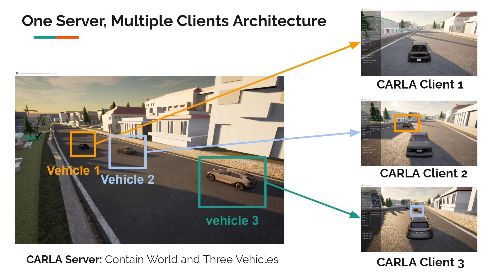
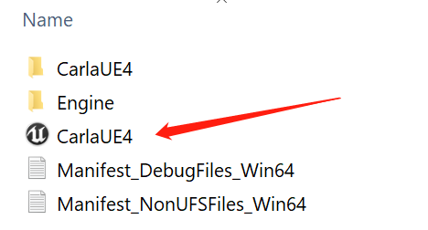
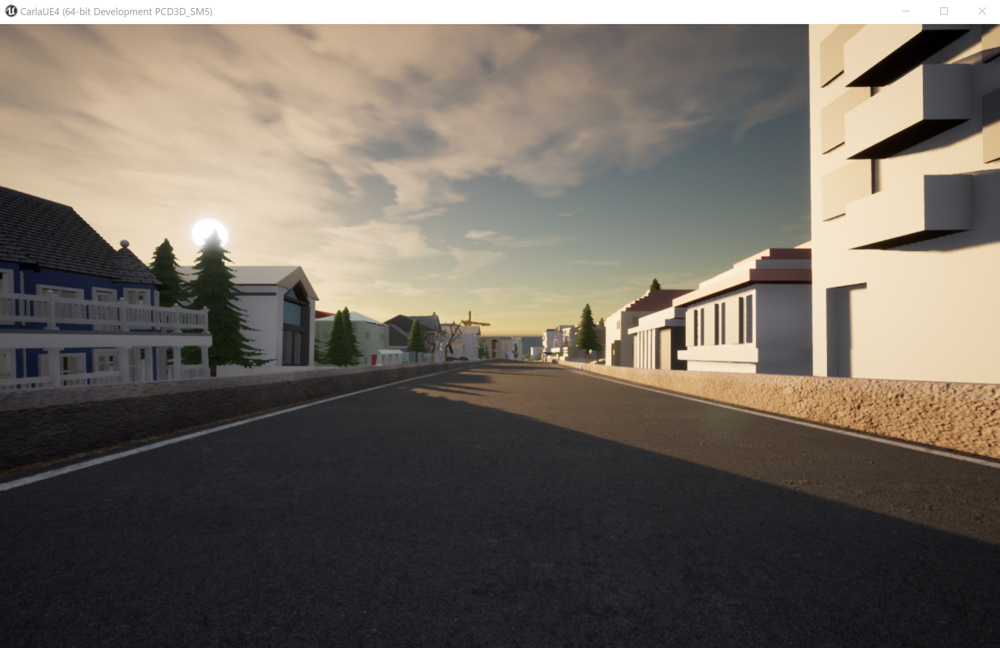
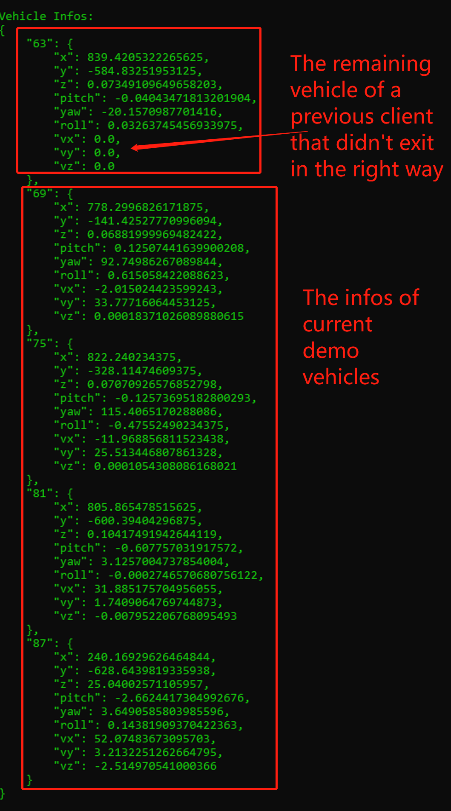

# ROAR_Multi_Client_Sim
 Support Multiple Clients Simulation in a single World(Berkeley Minor Map).
 
## Author:
* Jingjing Wei    (jingjingwei@berkeley.edu)


# Instructions
 Please follow the instructions below and also watch the [**vedio instruction**](https://youtu.be/noZPgLma6BA) I published on YouTube.

## Environment Setup (Windows 10)

### Step 1: Download the Berkeley minor map:
- The zip file is [available here](https://drive.google.com/file/d/1hyI9SyjxFG7IV-c6RQxz26fs5LijRogY/view?usp=sharing). 
- Please make sure **you download the engine from this link**, since there are multiple carla version and engines within ROAR project.
- Please download it to a disk with more than 10GB available spaces, and then unzip the file.
- After that, you can get a `Carla` folder.

### Step 2: Install Anaconda
https://docs.anaconda.com/anaconda/install/index.html
[Important] Please use your `Anaconda Powershell Prompt`

### Step 3: Clone code and Setup Environment
[Important] Please use your `Anaconda Powershell Prompt`
1. Clone the repo
```
git clone https://github.com/Allison-1999/ROAR_Multi_Client_Sim.git
```
2. Create a new virtual environment and activate it
```
conda create -n roar_multi_client_3.7.7 python=3.7.7
```
Press Y if terminal asks you to install the dependencies.
Then
```
conda activate roar_multi_client_3.7.7
```
3. Install packages
All dependencies have been put into requirements.txt
```
cd ROAR_Multi_Client_Sim
pip install -r requirements.txt
```

## Demo (Windows 10)

### 1. Start the UE4 simulator (server)
Step into the `Carla` folder you got in the Setup step 1
, which contains the following files, the file pointed by the arrow is the simulator we need to run later.



Double click the `CarlaUE4`, then a simulator window with Berkeley minor map will be opened as followed:


### 2. Start clients
**You should get the same results as [this vedio](https://youtu.be/AVae--XGkb0)**

A Windows .bat script has been provided to generate the same demo.

Please step into the client folder under ROAR_Multi_Client_Sim
```
cd client
```
Then run the script:
```
.\run_example.bat
```
Then you should see new windows/clients (a window that should information of a vehicle and tracking a vehicle, can be called as Client in this environment) and vehicles are created one by one with 15 second interval to avoid collision.
If the clients hasn't started as the demo vedio, please refer to the first entry under Common Problems and Solutions part below.

### 3. The expectation of the demo results:
[**Demo Video Link**](https://youtu.be/AVae--XGkb0)
* Four vehicles can be generated one by one into the same map.
* Each vehicle will be controlled by one client to run around the map one loop and then stop near the starting point
* The `information of all current vehicles` will be dynamically shown on the terminal every 200 frames (around 3 sec), including the id of each vehicle and their `location(x,y,z)`, `rotation(pitch, yall, roll)`, and `velocity(vx,vy,vz)`. [**Short Video for vehicle infos**](https://youtu.be/d2K9msfDdkc)


## [Important] Common Problems and Solutions:
1. Multiple configuration problems can make .bat file failed to start a new clients. The most common one is the server (berkeley minor map) doesn't run on `port 2000`.[**`Important`**] The server should run on localhost port `2000` and `2001`.

In this case, you can try to run the 
```
python waypoints_generator.py
```
and it will show you the following Error information:

```RuntimeError: time-out of 2000ms while waiting for the simulator, make sure the simulator is ready and connected to 127.0.0.1:2000```
If you see this error, please delete all previous UE4 engine using Task Manager to make sure `port 2000` is available or restart your system.

2. **Bind Error** RuntimeError: trying to create rpc server for traffic manager; but the system failed to create because of bind error.
If you see the following information, please restart your system to kill any possible conflict python process.
```
Traceback (most recent call last):
  File "auto_agent_run.py", line 991, in <module>
    main()
  File "auto_agent_run.py", line 983, in main
    game_loop(args)
  File "auto_agent_run.py", line 864, in game_loop
    controller = KeyboardControl(world, args.autopilot)
  File "auto_agent_run.py", line 277, in __init__
    world.player.set_autopilot(self._autopilot_enabled)
RuntimeError: trying to create rpc server for traffic manager; but the system failed to create because of bind error.
```

3. Please make sure close the clients by pressing `ctrl + c` in the terminal of each client (the one shows the vehicle infos log). The client is responsible to destroy the vehicle model. If you close the client in a wrong way, the vehicle will still staying in the world without a client to control it. The following picture is an example of the results of this kind of problem. You can find an additional idel vehicle besides the four vehicles in the demo.


**If you still have other problems, please feel free to contact [jingjingwei@berkeley.edu](jingjingwei@berkeley.edu) with a title start with [Issue].**


## References:
[1]Dosovitskiy, A., Ros, G., Codevilla, F., Lopez, A., & Koltun, V. (2017). Carla: An open urban driving simulator. In Conference on robot learning (pp. 1–16).

